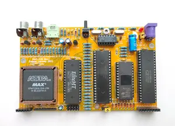

## Sizif-128

Easy-to-build minimalistic ZX Spectrum clone.

[(some random photos)](https://cloud.err200.net/index.php/s/73TR85tYZkMm8Ax?path=%2Fsizif-128)

Specifications:
- CPLD EPM7128SLC84 (128 macrocells)
- Z80 3.5 MHz
- 128K RAM
- AY-3-8910 (YM2149) mono sound
- Pentagon timings
- PAL encoder in CPLD (CRT TVs preferred)
- Intended to build on 9x15 prototyping board, but may be built on manufactured PCB

To modify and compile CPLD firmware you need Quartus 13.0sp1.
To modify schematic and pcb you need Kicad 6 or newer.

### Changelog
* Rev.A - first release. Please note the [errata](pcb/rev.A/ERRATA.txt).
* Rev.B - experimental PCB
    * 74HCU04-based tape input
    * added power LED
    * added reset button
    * removed NMI button
    * C20 replaced by variable variant to tune PAL color signal
* Rev.C
    * 74HCU04-based tape input reverted back to transistor-based
    * unused U6 inputs has been grounded
    * video circuit has been tuned for best colors
    * all pcb tracks are fancy now ;)
* Rev.C1
    * improve tape input sensitivity (thanks to SerOne from zx-pk forum)

