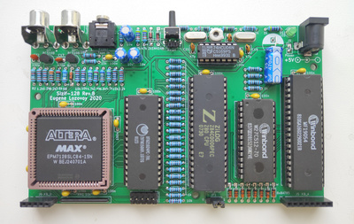

## Sizif-128

Easy-to-build minimalistic ZX Spectrum clone.

Specifications:
- CPLD EPM7128SLC84 (128 macrocells)
- Z80 3.5 MHz
- 128K RAM
- AY-3-8910 (YM2149) mono sound
- Pentagon timings
- PAL encoder in CPLD (CRT TVs preferred)
- Intended to build on 9x15 prototyping board, but may be built on manufactured PCB

To modify and compile CPLD firmware you need Quartus 13.0sp1.
To modify schematic and pcb you need Kicad 5.1.4 or newer.

Please note the [errata](pcb/rev.A/ERRATA.txt) for rev.A pcb.

[Some photos](https://cloud.err200.net/index.php/s/73TR85tYZkMm8Ax?path=%2Fsizif-128)
